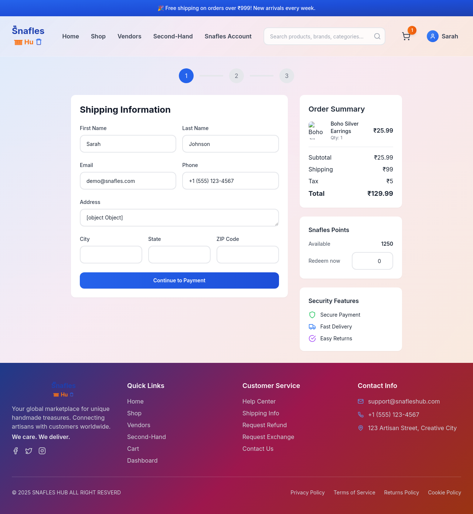
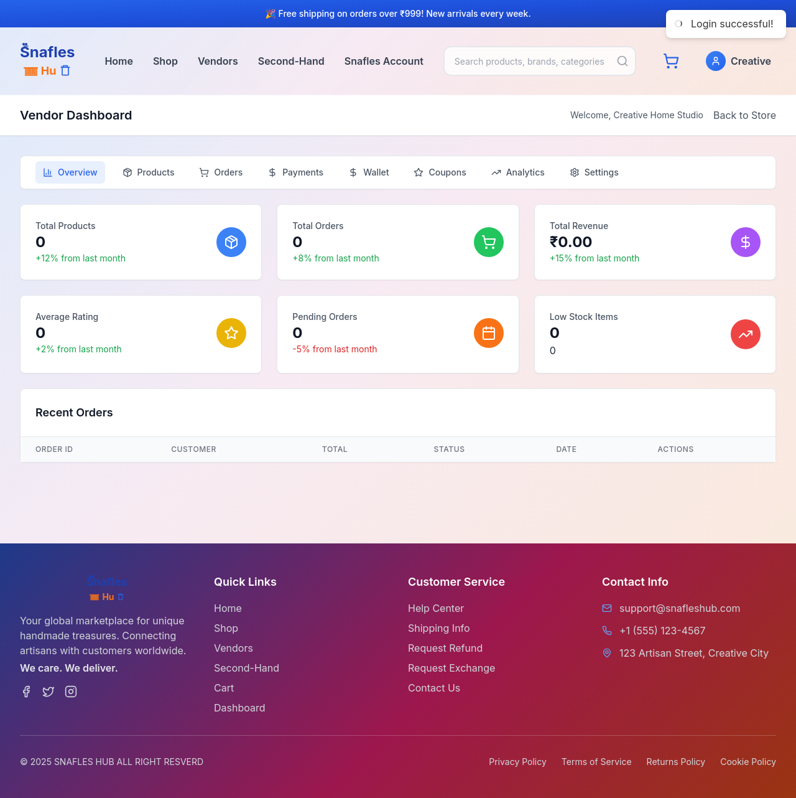
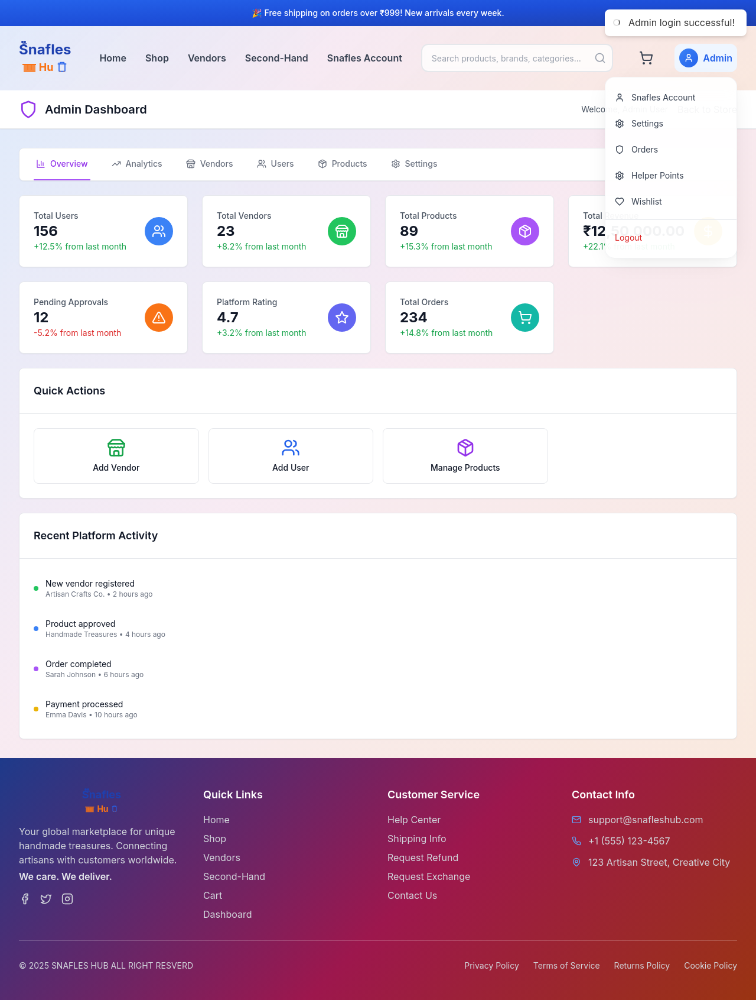

# SNAFLEShub Marketplace

SNAFLEShub is a full-stack marketplace for handcrafted and second-hand goods. This mono-repo houses both the React frontend (Vite) and the Node/Express API, plus a lightweight mock server used by the end-to-end smoke tests.

## Repository Layout

```
backend/     Express API, Mongo models, mock server, scripts
frontend/    React application (Vite, Tailwind, contexts/zustand helpers)
run-dev.js   Helper script that installs deps and boots backend + frontend together
run-e2e.js   Headless smoke test harness (Puppeteer + mock API)
tests/e2e/   Smoke test fixtures and captured artifacts
SECURITY.md  Security hardening notes and configuration checklist
DEPLOYMENT.md Deployment guidance, infrastructure, and observability tips
```

## What’s Included

### Customer Experience
- Product catalogue with filtering, featured picks, and vendor storefronts
- Detailed product pages with rich media, specs, reviews, and related items
- Persistent cart, checkout, order tracking, loyalty/helper points, and wishlist

### Vendor & Admin Workflows
- Vendor dashboards for catalog + fulfilment insights
- Admin panels for catalogue moderation and platform metrics
- Seed scripts with demo vendors/products for fast onboarding

### Security & Platform Hardening
- JWT sessions delivered via HttpOnly cookies (no `localStorage` tokens)
- Double-submit CSRF protection with rotating tokens
- Request sanitisation middleware to defuse NoSQL-injection vectors
- Helmet, strict CSP/HSTS, and environment-driven CORS controls
- Rate limiting with stricter caps on authentication endpoints

See `SECURITY.md` for deeper configuration notes.

## UI Snapshots

| Home & Catalog | Checkout | Vendor Dashboard | Admin Dashboard |
| --- | --- | --- | --- |
|  |  |  |  |
|  |  |  |  |

## Getting Started

### Prerequisites
- **Node.js 18+** (LTS recommended) & npm
- **MongoDB 5.0+** (local instance or MongoDB Atlas)
- **Stripe account** (use Test mode keys in development)

Verify your toolchain:
```bash
node -v   # expect >= 18
npm -v
mongod --version
```

Helpful downloads:
- Node.js: <https://nodejs.org/en/download>
- MongoDB Community Server: <https://www.mongodb.com/try/download/community>
- MongoDB Atlas: <https://www.mongodb.com/cloud/atlas>

### Install dependencies
```bash
cd frontend && npm install
cd ../backend && npm install
# or from repo root
node run-dev.js --install-only   # installs frontend + backend if node_modules missing
```

### Configure environment
1. Copy the samples:
   ```bash
   cp frontend/env.example frontend/.env.local
   cp backend/env.example backend/.env
   ```
2. Supply values:
   - `VITE_API_URL`: Frontend API base (defaults to `http://localhost:5000`).
   - `VITE_STRIPE_PUBLISHABLE_KEY`: Stripe publishable key (`pk_test_...`).
   - `PORT`: Backend port (`5000` by default).
   - `MONGODB_URI`: Mongo connection string (local or Atlas URI).
   - `JWT_SECRET`: Long random string—rotate per environment.
   - `STRIPE_SECRET_KEY`: Stripe secret key (`sk_test_...`).
   - Optional: `FRONTEND_URL` (CORS + email links), SMTP creds (`EMAIL_HOST`, `EMAIL_PORT`, `EMAIL_USER`, `EMAIL_PASS`), upload limits, rate-limiter overrides, etc.

### Run the dev stack (recommended)
```bash
node run-dev.js                 # boots API + frontend together
node run-dev.js --mock-backend  # use the mock API (no MongoDB required)
# Optional flags:
#   --backend-port=5050 --frontend-port=5190
#   --mock-backend (combine with custom ports)
```

### Manual option
```bash
# Terminal 1 – backend (real API)
cd backend && npm run dev
# Terminal 2 – frontend
cd frontend && npm run dev
```
Servers bind to `127.0.0.1` by default; export `HOST=0.0.0.0` or use the CLI flags if you need LAN access.

## Available Scripts

| Location | Command | Description |
| --- | --- | --- |
| repo root | `node run-dev.js` | Install (if needed) and run backend + frontend |
| repo root | `node run-e2e.js` / `npm run test:e2e` | Launch mock API + UI and execute the smoke scenario (Puppeteer) |
| frontend | `npm run dev` / `build` / `preview` / `lint` | Standard Vite workflows |
| frontend | `npm run install:all` | Install frontend and backend dependencies from the frontend folder |
| backend | `npm run dev` / `start` | Nodemon vs node for the live API |
| backend | `npm run dev:mock` / `start:mock` | Run the mock server (no MongoDB) |
| backend | `npm run seed` / `npm run reset:db` | Populate or reset seed data |

## Testing

- `npm run test:e2e` spins up the mock API + frontend, drives a shopper/vendor/admin flow with Puppeteer, and stores screenshots + summaries in `tests/e2e/artifacts/<timestamp>/`.
- Add deeper unit/integration coverage under `frontend/src/__tests__/` or `backend/tests/` when you extend the suite.

## Documentation & Next Steps

- `frontend/README-React.md` – UI-specific patterns and scripts
- `backend/README.md` – API endpoints, models, and seed data
- `SECURITY.md` – Cookie + CSP setup, rate limits, secret management, etc.
- `DEPLOYMENT.md` – Production rollout, reverse proxy/TLS, process management, and observability

## Deployment Snapshot

1. Build frontend: `cd frontend && npm run build`
2. Deploy backend behind a process manager (PM2/systemd) with `npm start`
3. Serve `frontend/dist` via your CDN/proxy (Netlify, Vercel, CloudFront, Nginx, etc.)
4. Forward `/api` traffic to the Express app, enable HTTPS, and provide the environment variables documented in `DEPLOYMENT.md`

## Troubleshooting

- **MongoDB connection errors (`ECONNREFUSED`, `MongoNetworkError`)**: Ensure MongoDB is running locally (`mongod`) or that your Atlas cluster is accessible and your IP is allow-listed.
- **Stripe not configured**: API responses such as `Stripe not configured. Set STRIPE_SECRET_KEY.` indicate the backend secret key is missing—add it to `backend/.env` and restart. Use test keys in development.
- **CORS blocked**: Set `FRONTEND_URL` (and update `CORS_ORIGINS` if needed) in `backend/.env` to match your frontend origin, then restart the server.
- **Port already in use**: Change `PORT` in `backend/.env`, or stop the conflicting process.
- **Invalid/expired JWT after secrets change**: Rotating `JWT_SECRET` invalidates old cookies. Users must log in again.

## Support & Contributions

- Open GitHub issues for bugs or feature requests.
- Follow the lint rules (`npm run lint`) before opening PRs.
- Keep credentials out of source control—stick to the provided `.env.example` templates.
- Want to contribute? Fork the repo, create a feature branch, commit, push, and open a PR describing your changes and tests.

## License

MIT

## Contact

Questions or ideas? Email `support@snafleshub.com` or open an issue.
